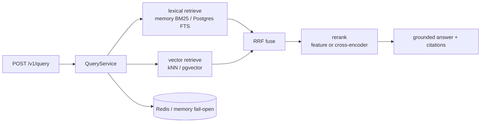

# Production RAG Backend

[](https://github.com/alexbohachev/production-rag-backend/actions/workflows/ci.yml)


Hybrid retrieval HTTP API: **BM25 ∥ vector → RRF → rerank → grounded citations**, with API-key auth, idempotent ingest, Redis cache, Postgres/pgvector, Prometheus, Docker, and CI.

Synthetic ops corpus — **not employer source**. Interactive contract: [`/docs`](http://localhost:8000/docs) after start.

## 60-second demo

```bash
docker compose -f docker-compose.simple.yml up --build
```

```bash
curl -s localhost:8000/health
curl -s -H "X-API-Key: dev-key" localhost:8000/ready
curl -s -H "X-API-Key: dev-key" -H "Content-Type: application/json" \
  --data-binary @docs/examples/query_payload.json \
  localhost:8000/v1/query
curl -s -H "X-API-Key: dev-key" localhost:8000/v1/eval/recall-at-5
```

Full stack (Postgres/pgvector + Redis):

```bash
docker compose up --build
```

Example responses: [`docs/examples/`](docs/examples/) · Smoke script: [`scripts/smoke_api.sh`](scripts/smoke_api.sh)

## Architecture



Memory path uses Okapi-style BM25. Postgres path uses `tsvector` / `ts_rank_cd` for lexical retrieval (honest FTS, not claiming Okapi inside SQL).

## Eval (synthetic)

| Mode | Recall@1 | Recall@5 |
| --- | --- | --- |
| bm25 | 0.808 | 1.000 |
| vector | 0.692 | 0.885 |
| hybrid | 0.731 | 0.885 |
| reranked | 0.846 | 1.000 |

26 labeled queries. Not AgriChain metrics (private: 72% → 88% on 150 internal queries). Details: `eval/README.md`.

## Local development

```bash
pip install -r requirements-dev.txt
pytest -q
uvicorn app.main:app --reload
```

OpenAPI: `http://localhost:8000/docs` (Authorize with `dev-key`).

Optional MiniLM + cross-encoder: `pip install -r requirements-ml.txt`, then `EMBEDDING_BACKEND=minilm` and `RERANK_BACKEND=cross_encoder`. CI/Docker stay on `hash` + `feature`.

Study notes (UA): [`STUDY.md`](STUDY.md).
