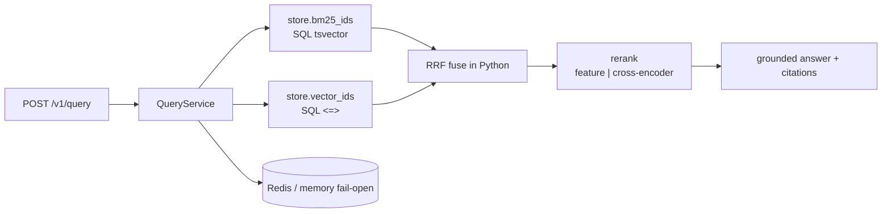

# Production RAG Backend

[](https://github.com/alexbohachev/production-rag-backend/actions/workflows/ci.yml)


Hybrid retrieval HTTP service: auth, BM25 ∥ vector, RRF, feature or MiniLM cross-encoder rerank, grounded citations, Redis cache, Prometheus, Docker, CI.

Synthetic ops corpus. **Not AgriChain source.** Production AgriChain uses Elasticsearch; this repo is the public backend shape (Postgres/pgvector or in-memory).

## Architecture



SQL retrieves candidates; RRF + rerank stay in Python (honest hybrid split for interviews).

## Quick start

```bash
pip install -r requirements-dev.txt
pytest -q
uvicorn app.main:app --reload
```

```bash
curl -s localhost:8000/health
curl -s -H "X-API-Key: dev-key" -H "Content-Type: application/json" \
  -d '{"query":"Where to mount GPS-tracker SK-12?","top_k":3,"include_trace":true}' \
  localhost:8000/v1/query
curl -s -H "X-API-Key: dev-key" localhost:8000/v1/eval/recall-at-5
curl -s -H "X-API-Key: dev-key" localhost:8000/v1/meta
```

Local MiniLM embeddings + cross-encoder: `pip install -r requirements-ml.txt` and set `EMBEDDING_BACKEND=minilm`, `RERANK_BACKEND=cross_encoder`. CI/Docker stay on `hash` + `feature`.

## Eval (synthetic only)

`GET /v1/eval/recall-at-5` returns `recall_at_1` and `recall_at_5` on **this** labeled set. Those numbers are not AgriChain. Private production note: `eval/README.md`.

`Idempotency-Key` on `POST /v1/documents` replays the first result.

Дивись **STUDY.md** — BM25 vs vector vs hybrid українською.
