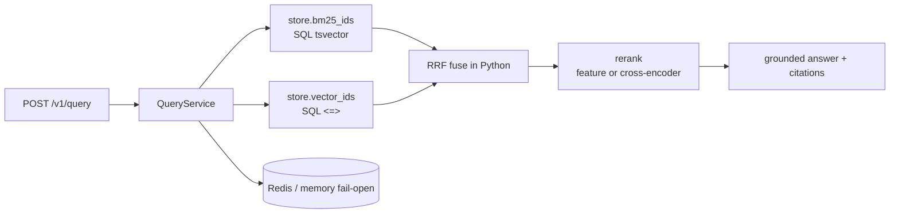

# Production RAG Backend

[](https://github.com/alexbohachev/production-rag-backend/actions/workflows/ci.yml)


FastAPI **hybrid retrieval** HTTP service: BM25 ∥ vector → RRF → rerank → grounded citations, with auth, idempotent ingest, Redis cache, Postgres/pgvector, Prometheus, Docker, and CI.

Synthetic ops corpus. **Not AgriChain source.** Production AgriChain uses Elasticsearch; this repo is the public backend shape.

## What this proves (CV mapping)

| CV claim | Where in this repo |
| --- | --- |
| Hybrid BM25 + vector, RRF, rerank | `app/domain/ranking.py`, `app/rerank.py`, `app/services/query.py` |
| API keys + idempotent ingest | `app/api/routes.py` (`X-API-Key`, `Idempotency-Key`) |
| Redis cache | `app/infra/cache.py` (fail-open) |
| Postgres/pgvector | `app/infra/pg_store.py` (SQL BM25 + `<=>`, GIN + HNSW) |
| Prometheus | `GET /metrics` |
| Docker + GitHub Actions | `Dockerfile`, `docker-compose.yml`, `.github/workflows/ci.yml` |
| 26 labeled queries, Recall@1/@5 | `eval/labels.json`, `GET /v1/eval/recall-at-5` |
| 18 tests, CI green | `tests/`, Actions badge above |

## Architecture



SQL retrieves candidates; RRF + rerank stay in Python (honest hybrid split for interviews).

## Run with Docker

**Full stack** (Postgres/pgvector + Redis):

```bash
docker compose up --build
```

**API only** (in-memory store, no Postgres):

```bash
docker compose -f docker-compose.simple.yml up --build
```

Then:

```bash
curl -s localhost:8000/health
curl -s -H "X-API-Key: dev-key" -H "Content-Type: application/json" \
  -d '{"query":"GPS-tracker SK-12 metal roof firmware","top_k":3,"include_trace":true}' \
  localhost:8000/v1/query
curl -s -H "X-API-Key: dev-key" localhost:8000/v1/eval/recall-at-5
```

## Example responses

Captured from a seeded run (`EMBEDDING_BACKEND=hash`, `RERANK_BACKEND=feature`):

**Query** → [`docs/examples/query_response.json`](docs/examples/query_response.json)

```json
{
  "answer": "Based on GPS tracker SK-12 install: The GPS-tracker SK-12 must sit on a metal roof...",
  "citations": [{"doc_id": "doc-05", "title": "GPS tracker SK-12 install", "...": "..."}],
  "retrieval": {
    "bm25_ids": ["doc-05", "..."],
    "vector_ids": ["..."],
    "fused_ids": ["..."],
    "reranked_ids": ["doc-05", "..."],
    "rerank_backend": "feature"
  }
}
```

**Eval** → [`docs/examples/eval_response.json`](docs/examples/eval_response.json)

| Mode | Recall@1 (synthetic) | Recall@5 (synthetic) |
| --- | --- | --- |
| bm25 | 0.808 | 1.000 |
| vector | 0.692 | 0.885 |
| hybrid | 0.731 | 0.885 |
| reranked | 0.846 | 1.000 |

These numbers are **not** AgriChain (private: 72% → 88% on 150 internal queries). See `eval/README.md`.

## Local tests

```bash
pip install -r requirements-dev.txt
pytest -q
```

MiniLM + cross-encoder locally: `pip install -r requirements-ml.txt` and set `EMBEDDING_BACKEND=minilm`, `RERANK_BACKEND=cross_encoder`. CI/Docker stay on `hash` + `feature`.

Дивись **STUDY.md** — BM25 vs vector vs hybrid українською.
